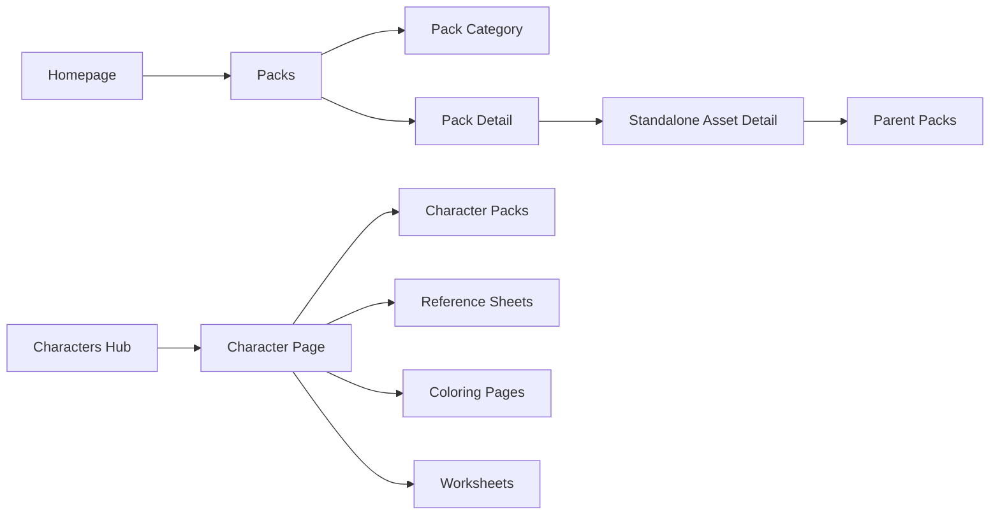

# Bundle-First Strategy

## Decision

clip.art is moving toward a bundle-first content model.

Standalone clip art remains part of the product, but the primary browsing, SEO, download, sharing, and marketplace story should increasingly revolve around packs. Once clip.art has at least 100 high-quality published packs, the homepage should shift from a mixed clip-art-first surface to a bundle-first surface.

The goal is:

> Build with sets, not scattered singles.

## Strategic Model

Packs become the main product unit. Individual assets become the inventory, proof, and detail-level SEO depth inside and around those packs.

## Product Rules

- Packs are the primary unit for browsing, downloading, sharing, selling, and marketplace export.
- Standalone public clip art should eventually belong to at least one pack.
- Standalone detail pages should stay alive for SEO and individual downloads, but they should cross-link back to parent packs.
- Pack pages should include enough item previews to prove quality before download.
- Category and homepage surfaces should emphasize coordinated sets, not isolated assets, once pack inventory is deep enough.
- New pack releases should be announced through pack release notifications so users notice important drops even before the homepage becomes bundle-first.

## Homepage Threshold

### Before 100 Published Packs

Keep the current mixed homepage structure:

- Generator remains prominent.
- Visual examples and use cases still matter.
- Packs are promoted as an important product surface.
- Standalone clip art can still carry discovery while pack inventory grows.

### At 100+ Published Packs

Shift the homepage to bundle-first:

- Hero promotes ready-made packs and the value of coordinated sets.
- Above-the-fold visual proof should use pack covers, pack mosaics, and bundle previews.
- Below the fold, show pack sections for major clip art categories.
- Near the end of the page, include a large general pack browsing section before the footer.
- Standalone assets appear as contents of packs, supporting thumbnails, and detail-level cross-links rather than the primary homepage story.

## URL Architecture

### Packs

- `/packs` - in-app pack storefront and browsing surface.
- `/packs/{category}` - pack category page.
- `/packs/{category}/{slug}` - pack detail page.
- `/packs/characters` - pack category page for character bundles.

`characters` is a pack category when the user is browsing bundles. It should include packs such as reference sheets, expressions, poses, outfits, props, scenes, and other character-based collections.

### Design Bundles

- `/design-bundles` - public marketing page for bundle creation, sharing, and marketplace distribution.

This page explains the product promise. It is not the pack storefront.

### Characters

- `/characters` - public hub for named clip.art characters.
- `/characters/{slug}` - canonical page for one named character.

Character pages are not just pack category pages. They are character IP pages that can gather multiple artifact types under one identity:

- Reference sheets.
- Related packs.
- Standalone clip art.
- Coloring pages.
- Worksheets.
- Future scenes, animations, stickers, or story assets.

## Character V1

V1 should avoid a database migration and use a small registry file, likely `src/data/characters.ts`.

The registry should support:

- `slug`
- `name`
- `tagline`
- `bio`
- `traits`
- `referenceSheets`
- `packSlugs`
- Future relationship arrays for clip art, coloring pages, worksheets, and animations.

Initial character:

- `orion-foxwell`
- Page: `/characters/orion-foxwell`
- Related pack: the Orion Foxwell vintage collection.
- Primary reference sheet: the Orion Foxwell detective character sheet.

The Orion pack detail page should show a "Character Reference Sheet" section when the pack maps to Orion. The character page should show the reference sheet and all related packs.

## When To Expand To Database

Keep V1 config-based until one of these is true:

- There are 5+ named characters.
- Admins need to create or edit characters without code changes.
- Character pages need filtering, sorting, or search.
- Character relationships become many-to-many across packs, generations, worksheets, and coloring pages.
- ESY starts generating character artifacts and returns `character_slug` or `character_id`.

Likely schema later:

- `characters`
- `character_packs`
- `character_assets`
- Optional artifact relationship tables for worksheets, coloring pages, animations, and stickers.

## Standalone Asset To Pack Linking

Standalone clip art pages should eventually show pack context:

- "Part of this pack" when the asset belongs to one pack.
- "Also included in" when the asset belongs to multiple packs.
- "More from this character" when the asset belongs to a named character.
- "Build the full set" CTA pointing to the strongest parent pack.

Implementation should prefer existing `pack_items` relationships before adding new fields. If an asset appears in multiple packs, rank parent packs by published status, category fit, item count, and download/sales signal.

## Category Page Direction

As pack inventory grows, category pages should lead with pack modules:

- A featured pack or pack row near the top.
- Category-specific pack collections before or alongside individual asset grids.
- Individual assets still support long-tail SEO and browsing depth.

## Release Notification Direction

Pack launches should become part of the bundle-first browsing loop. See `docs/features/PACK_RELEASE_NOTIFICATIONS.md`.

V1 behavior:

- Admins can manually launch a pack release notification from `/admin/packs`.
- Admins can enable auto-launch when publishing a pack from `/admin/packs`.
- Users see the active release on the Packs gift icon until they click it.
- Dismissal is keyed by release, so future drops can still be announced.

## Operating Principle

Do not delete or devalue standalone clip art. Reframe it.

Standalone assets are the building blocks. Packs are the product.

