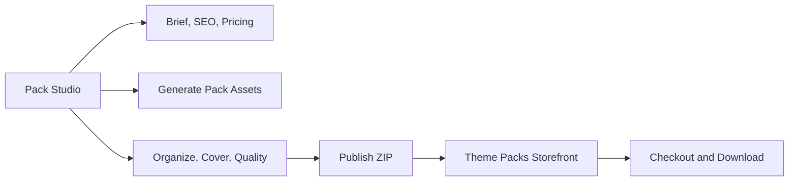

# Pack Studio V1

## Goal

Pack Studio turns `/create/packs` from a simple grouping tool into a seller-grade workspace for creating, pricing, generating, organizing, and publishing commercial clip art bundles.

The product promise:

> Create a cohesive, commercially useful clip art bundle from brief to ZIP.

Theme Packs remain the storefront and browse/download surface. Pack Studio is the creator surface.

## Current Foundation

The workspace lives in `app/(app)/create/packs/page.tsx`. It already supports:

- Creating a pack draft.
- Editing title, description, category, tags, and visibility.
- Adding assets from a user's library.
- Adding assets from the public catalog.
- Batch generating new clip art into a pack.
- Selecting a cover from pack items.
- Publishing and rebuilding the downloadable ZIP.

The schema from `db/add-packs.sql` already includes core commerce and publish fields:

- `is_free`
- `price_cents`
- `stripe_price_id`
- `zip_status`
- `zip_url`
- `item_count`
- `visibility`
- `is_published`

`pack_items.is_exclusive` also exists, but the creator UI does not expose it yet.

## V1 Scope

### Seller-Grade Metadata

Pack metadata should support both app organization and public selling:

- `audience`
- `pack_goal`
- `description` as the short/card summary
- `long_description` for SEO and marketing
- `whats_included`
- `use_cases`
- `license_summary`

The short description should remain concise. Long descriptions belong in their own field so the public pack detail page can rank and convert without making the workspace summary unreadable.

### Pricing

Creator pricing should support simple one-off bundle sales:

- Free/Paid toggle.
- Regular price.
- Optional compare-at price.
- Optional launch price.
- Optional launch end date.

Keep coupons, discount codes, and complex price history out of V1.

Initial guidance:

- 20-item standard pack: `$5-$7`
- 50-item cohesive premium pack: `$9-$12`
- 50-item pack with templates/printables: `$15-$19`
- 100+ hero pack: `$19-$29`

### Cover Control

Auto-cover is useful as a fallback, but creators need obvious control:

- Current cover shown clearly in the left summary.
- Asset cards expose an obvious `Set cover` action.
- Support clearing the explicit cover to return to automatic cover selection.

Defer custom cover uploads, cover cropping, and generated cover collages until after V1.

### Pack-Exclusive Assets

Generated pack assets should default to pack-exclusive so paid bundles do not feel like repackaged public catalog content.

Creator-facing labels:

- **Pack-exclusive**: only sold/downloaded inside this pack.
- **Reusable in my packs**: can be reused across the creator's bundles.
- **Public catalog**: can appear in public search/browse.

V1 should use `pack_items.is_exclusive` for pack exclusivity. If the app needs a separate generation-level availability flag, add it conservatively.

### Batch Generation UX

The current batch generation area should feel like a pack asset planner, not an internal prompt dump.

Replace unclear language like `Generate (Pack-Aware)` with:

- Tab: `Generate`
- Panel title: `Generate assets for this pack`
- Helper copy: `Add one idea per row. We'll use your pack brief, audience, style, and settings to keep the images consistent.`

Replace the single textarea with a row-based batch builder:

- Default prompt rows.
- `+ Add idea` button.
- Remove row action.
- Optional item title per row.
- `Paste list` support for newline-separated ideas.
- Count derived from rows.
- Advanced setting for variations per idea.

Advanced controls should include:

- Model selection with `Recommended` as the default.
- Full clip art style list from `src/lib/styles.ts`.
- Variations per idea.
- Background/transparency target.
- Default asset availability.
- Shared style notes.
- Avoid list if supported.
- Keep-cohesive toggle.

Model IDs must remain explicit and must not use floating aliases such as `latest`, `auto`, or generic marketing aliases.

### Quality and Readiness

V1 readiness checks should be deterministic:

- Title present.
- Short description present.
- Long description present for public/paid packs.
- Category selected.
- At least 3 tags.
- Cover set.
- Price set for paid packs.
- Minimum 12 assets.
- 20 assets recommended.
- Transparent PNG coverage.
- Clip art only.
- ZIP state visible.

Avoid AI quality scoring in clip.art until ESY owns that layer.

### Public Detail Page

The design bundle detail page should render the selling copy:

- Short summary near purchase/download CTA.
- Long description.
- What's included.
- Use cases.
- License summary.
- Item count, transparent PNG, and commercial-use trust badges.

### Navigation

Separate creation from browsing:

- `/create/packs` should be labeled `Pack Studio`.
- `/design-bundles` should remain `Theme Packs` or `Design Bundles`.
- The signed-in create navigation should point to Pack Studio, not the browse page.
- Library should expose Pack Studio because users manage assets and bundles together.

## Not In V1

- Full seller storefronts.
- Coupon system.
- Complex discount scheduling.
- Sales analytics dashboard.
- Multi-user collaboration.
- AI quality scoring.
- Custom cover designer.
- Generated cover collage builder.

## Implementation Order

1. Add schema and API support for pack metadata, pricing fields, and availability.
2. Update Pack Studio metadata, pricing, cover, and long-description UI.
3. Redesign batch generation as a multi-row idea builder.
4. Wire pack-exclusive defaults through add/generate flows.
5. Add deterministic readiness checks.
6. Render long-form selling copy on public bundle detail pages.
7. Clarify navigation labels and routes.
8. Run lint checks and focused manual flow checks.
